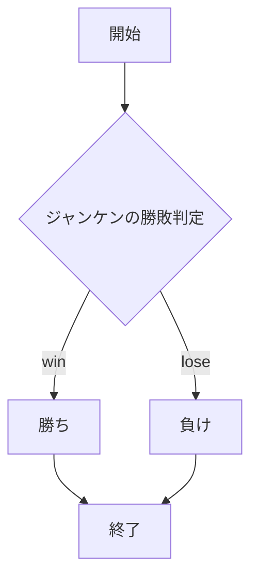
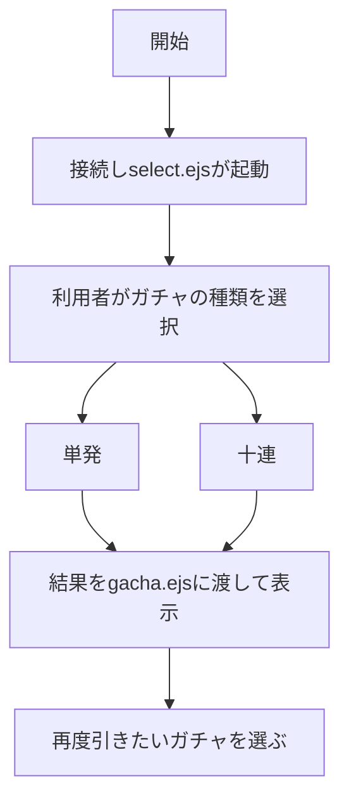
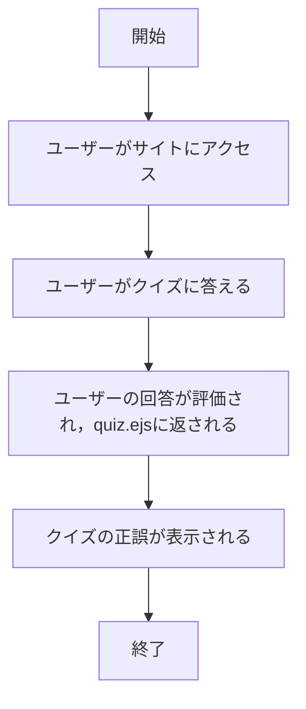

# webpro_06

## このプログラムについて
このプログラムはNode.jsを用いてサーバーを立てるアプリケーションである.

## ファイル一覧
| ファイル名          | 説明                   |
|---------------------|------------------------|
| `app5.js`           | プログラム本体         |
| `views/show.ejs`    | 挨拶メッセージの表示用 |
| `views/icon.ejs`    | アイコン表示用         |
| `views/luck.ejs`    | おみくじ結果表示用     |
| `views/janken.ejs`  | じゃんけん結果表示用   |
| `public/janken.html`| じゃんけんの開始画面   |
| `views/gacha.ejs`   | ガチャ結果表示用       |
| `views/quiz.ejs`    | クイズ表示用           |


## 起動方法
**１．Githubからwebpro_06をクローンする**
ターミナル上で以下のコマンドを実行
```bash
 git clone https://github.com/SaToHaRuKu/webpro_06.git　
 ```

**２．npmのインストール**
ターミナル上でnpmのインストールを行う
```bash
npm　 install 
```
**３．サーバーの立ち上げ**
サーバーを立ち上げる
```bash
node app5.js 
```

**4.サイトへの接続**
それぞれの機能には以下のURLにブラウザでアクセスする

| URL |
|--------|
| 挨拶メッセージ: http://localhost:8080/hello1  |
| おみくじ: http://localhost:8080/luck  |
| じゃんけん: http://localhost:8080/janken  |
| ガチャ: http://localhost:8080/gacha  |
| クイズ: http://localhost:8080/quiz |

## git hubでの管理
**githubへのファイルの追加,変更**
githubにあるファイルを更新したい場合は,以下のコマンドを打ち込む.
```
git add .
git commit -am '更新内容を示すコメント'
git push
```

## 機能説明

## 1.挨拶メッセージ
- 挨拶のメッセージを表示するアプリケーションはapp5.js内のhello1とhello2がある.hello1とhello2の違いは情報の処理方法であり,返す値は同じである.ここではhello1の解説を行う.
- 概要:フランス語と日本語での挨拶を表示する
- 使用方法:サイトにアクセスすると自動で表示される
- ファイル:view/show.ejs

#### プログラムの解説

app5.js内の変数であるconst message1,const message2にHello world,Bon jour を代入する.

```bash
  const message1 = "Hello world";
  const message2 = "Bon jour";
```

show.ejsにmessage1,message2をgreet1,greet2にし,引数として返す.

```bash
  res.render('show', { greet1:message1, greet2:message2});
```

show.ejsで二種類の挨拶を表示する.
```
<body>
  <h2>Message</h2>
  <p>挨拶1：<%= greet1 %></p>
  <p>挨拶2：<%= greet2 %></p>
</body>
```


## 2.おみくじ
- 概要:大吉,中吉のいずれかを表示し,運勢を占う.
- 使用方法:サイトにアクセスすると自動で表示される
- ファイル:view/luck.ejs

#### プログラムの解説
変数numに1から6のうちランダムな整数の値を代入する.
```bash
const num = Math.floor( Math.random() * 6 + 1 );
```

numの値が1の場合は大吉,2の場合は中吉を引数luckに代入する.この時,numが3から6の場合にはこのプログラムはluck.ejsに何も返さない.numが3から6の場合の処理も追加したい場合は,このプログラムに続く形でelse ifを用いてnumの値に対するluckを作成すれば良い.

```
if( num==1 ) luck = '大吉';
else if( num==2 ) luck = '中吉';
```

ターミナル上にluckを表示する.
```
console.log('あなたの運勢は' + luck + 'です' );
```

luck.ejsにnum,luckを返す.
```
res.render( 'luck', {number:num, luck:luck} );
```

luck.ejsでサイト上に運勢を表示する.
```
<body>
    <p>あなたの今日の運勢は<%= luck %>です．</p>
</body>
```

### 3.ジャンケン
- 概要:利用者とコンピュータのジャンケン対戦を実施できる.
- 使用方法:サイトにアクセスし,入力欄にグー,チョキ,パーのいずれかを入力するとコンピュータとの勝敗の判定が出来る.
- 結果ページ:view/janken.ejs
- HTMLフォーム:public/janken.html

#### プログラムの解説
使用する変数hand,win,totalを定義する.handは利用者の出した手,winは利用者がコンピュータとの対戦で勝利した回数,totalは勝負を施行した回数である.
```
let hand = req.query.hand;
let win = Number( req.query.win );
let total = Number( req.query.total );
```

ターミナル上にhand,win,totalを表示する.
```
console.log( {hand, win, total});
```

変数numに1,2,3のいずれかの値を代入する.

```
const num = Math.floor( Math.random() * 3 + 1 );
```

コンピュータの手cpuを初期化したのち,numの値によりコンピュータの出す手を変化させる.
```
let cpu = '';
if( num==1 ) cpu = 'グー';
else if( num==2 ) cpu = 'チョキ';
else cpu = 'パー';
```

コンピュータと利用者のジャンケンの勝敗を決める.勝敗を決める引数をjudgementとする.利用者の勝ちであればjudgementを"勝ち"とし,勝利回数であるwinを+1する.あいこであればjudgementは”あいこ",負けであればjudgementは"負け"となる.

```
let judgement = '';
if(hand == cpu){
    judgement = 'あいこ';
}else if(
    (hand == 'グー' && cpu == 'チョキ') ||
    (hand == 'チョキ' && cpu == 'パー') ||
    (hand == 'パー' && cpu == 'グー')
){
   judgement = '勝ち';
  win += 1;
}else{
    judgement = '負け';
}
```
勝負を施行した回数であるtotalを+1する.
```
total += 1;
```

jenken.ejsに返すデータを引数displayにまとめる.

```
const display = {
    your: hand,
    cpu: cpu,
    judgement: judgement,
    win: win,
    total: total
}
```

jenken.ejsにdisplayを返す.
```
  res.render( 'janken', display );
```

janken.ejsで利用者の出した手,コンピュータの出した手,勝敗判定,勝負回数を表示し,再度ジャンケンをする場合は再度自分の出したい手を入力,送信する.

```
<body>
    <p>あなたの手は<%= your %>です．</p>
    <p>コンピュータは<%= cpu %>です．</p>
    <p>判定：<%= judgement %></p>
    <p>現在<%= total %>試合中<%= win %>勝しています．</p>
    <hr>
    <form action="/janken">
        <input type="text" name="hand" required>
        <label for="hand">次は何を出す？</label>
        <input type="hidden" name="win" value="<%= win %>">
        <input type="hidden" name="total" value="<%= total %>">
        <input type="submit" values="じゃんけん　ポン">
    </form>   
</body>
```

## プログラムのフローチャート




### 4.ガチャ
- 概要:ランダムにアイテムを引くことができる.
- 使用方法:nodeでapp5.jsを立ち上げ，http://localhost:8080/selectに接続
- ファイル:view/gacha.ejs,select.ejs

#### プログラムの解説
初めて接続した際の起動画面をselect.ejsにより表示する．その後，ユーザーがガチャを引く回数を単発か十連か選び，結果をgacha.ejsを用いて表示する．

app5.jsには初回時の起動画面を表示するselectとガチャを引く回数を選択し，top関数を用いて抽選を行うgachaがある．


#####　抽選に用いられるitems

- **`name`**: アイテムの名前
- **`rarity`**: アイテムのレア度
- **`probability`**: アイテムが当選する確率（%単位）

```
const topItems = [
  { name: "メンデルスゾーン", rarity: "レア", probability: 15 },
  { name: "龍の呼び声", rarity: "レア", probability: 15 },
  { name: "無双竜鬼ミツルギブースト", rarity: "レア", probability: 15 },
  { name: "龍秘陣 ジャックポット・エントリー", rarity: "ベリーレア", probability: 10 },
  { name: "永遠のリュウセイカイザー", rarity: "スーパーレア", probability: 6 },
  { name: "「修羅」の頂 VAN・ベートーヴェン", rarity: "スーパーレア", probability: 6 },
  { name: "ニコルボーラス", rarity: "スーパーレア", probability: 6 },
  { name: "偽りの王 ヴィルヘルム", rarity: "スーパーレア", probability: 6 },
  { name: "偽りの王 モーツァルト", rarity: "スーパーレア", probability: 6 },
  { name: "夢双龍覇 モルトDREAM", rarity: "スーパーレア", probability: 1 },
  { name: "暴龍事変 ガイグレン", rarity: "ビクトリーレア", probability: 3 },
  { name: "龍世界 ドラゴ大王", rarity: "ビクトリーレア", probability: 3 },
  { name: "超戦龍覇モルトNEXT", rarity: "ダブルビクトリーレア", probability: 3 },
  { name: "ボルシャック・ドギラゴン", rarity: "レジェンドレア", probability: 3 },
  { name: "禁断～封印されしX～", rarity: "禁断レジェンドレア", probability: 3 },
];
```
##### 抽選を行うtop関数の仕組み
抽選を行うtop関数は以下の処理を実行する.

1. **ランダムな数値を生成**  
- `Math.random()`を用いて0から99のランダムな整数を生成する.
- この数値を基準に、配列内のどのアイテムが当選するかを決定する.

```
function top() {
  const num = Math.floor(Math.random() * 100);
```

2. **確率を加算しながら比較**

配列topItemsを1つずつループし、各アイテムのprobabilityを累積する.ランダムな数値numが累積した確率以下になった時点で、該当のアイテムを当選とする.

```
let sumProbability = 0;

for (const item of topItems) {
    sumProbability += item.probability;
    if (num <= sumProbability) {
        return item;
    }
}
```

3. **リクエストの処理**

クライアントが1回ガチャをするか10回ガチャをするか選択し，クライアントの選択したパラメータを取得する.また，抽選したアイテムを格納する配列"items"を宣言する．

```
app.get("/gacha", (req, res) => {
  const type = req.query.type; 
  let items = [];
```

4. **一回か十連かの識別**

ガチャの種類が"multi"の場合は10連ガチャ，そうでない場合は一回，top関数を用いてガチャを試行する．

```
  if (type === "multi") {
    for (let i = 0; i < 10; i++) {
      items.push(top());
    }
  } else {
    items.push(top());
  }

  res.render("gacha", { items });
```

5. **当選したアイテムの表示**

gacha.ejsにて,当選したアイテムを表示する.その後続けて抽選を行いたい場合は,単発か10連を選択する．


#### プログラムのフローチャート



### 5.クイズ
- 概要:クイズ機能．クイズを3題出題し，正解か不正解かの判定をする．
- 使用方法:http://localhost:8080/quizにアクセスする．
- ファイル:view/quiz

#### プログラム解説

1. **問題と選択肢の設定**

問題(`question`)と選択肢（`choise`）を定義する.また，正解の答え（`correctAnswer`）も変数として保持する.

```
  const questions = [
    {
      question: "日本の首都は?",
      choices: ["東京", "大阪", "名古屋", "福岡"],
      correctAnswer: "東京",
    },
    {
      question: "マラソン中に3番目の人を抜いたらあなたは何番になる？",
      choices: ["1番目", "2番目", "3番目", "4番目"],
      correctAnswer: "3番目",
    },
    {
      question: "信号が赤の灯火の点滅の場合車や路面電車はどうする？",
      choices: [ "停止位置で一時停止し、安全を確認したのち進行する", "歩行者に注意して徐行する", "他の交通に注意して進む"],
      correctAnswer: "停止位置で一時停止し、安全を確認したのち進行する",
    },
  ];
```

2. **利用者の回答を取得**
- 利用者の回答(`req.query.answer`)を取得する.

```
const userAnswers = req.query.answers || []; 
let results = null;
```

3. **回答の評価**

userAnswersがからでない場合にクイズの結果が計算される．resultsには各問題に対するユーザーの回答が正しいかどうかが判定され，その結果が"正解！"または"不正解！"という文字列で評価される．

```
  if (userAnswers.length > 0) {
    results = questions.map((q, index) => {
      const userAnswer = userAnswers[index];
      return userAnswer === q.correctAnswer ? "正解！" : "不正解！";
    });
  }
```

4. **結果の返却**

quiz.ejs(クイズ結果の表示ページ)がユーザーに表示される

```
  res.render("quiz", { questions, results });
```

#### フローチャート
