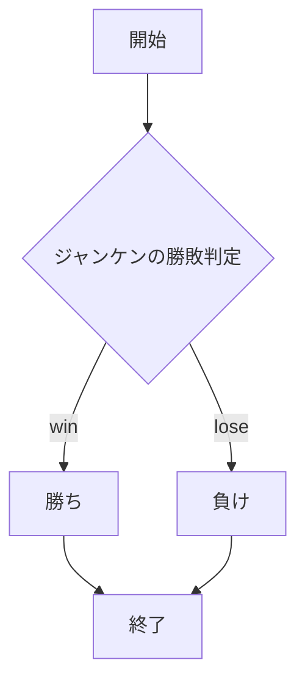

# webpro_06

## このプログラムについて

## ファイル一覧

ファイル名 | 説明
-|-
app5.js | プログラム本体
public/janken.html | じゃんけんの開始画面

## URL
http://localhost:8080/public/janken.html

## プログラムのフローチャート

```mermaid
flowchart TD;
start["開始"];
end1["終了"]
if{ジャンケンの勝敗判定}
win["勝ち"]
loose["負け"]


start --> if
if -->|win| win
win --> end1
if -->|lose| loose
loose --> end1
```