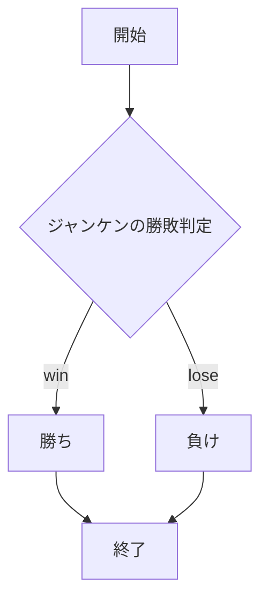

# webpro_06

## このプログラムについて

## ファイル一覧

ファイル名 | 説明
-|-
app5.js | プログラム本体
public/janken.html | じゃんけんの開始画面

## URL
http://localhost:8080/public/janken.html

## 使用方法
**１．Githubからwebpro_06をクローンする**
ターミナル上で git clone https://github.com/SaToHaRuKu/webpro_06.git　を実行

**２．npmのインストール**
install npm　を実行

**３．サーバの立ち上げ**
node app.5js を実行

**４．web上で各機能にアクセス**
http://localhost:8080/janken グー，チョキ，パーのいずれかを入力することでコンピュータとじゃんけんをすることができ，勝った回数をカウントする．

http://localhost:8080/

## プログラムのフローチャート

